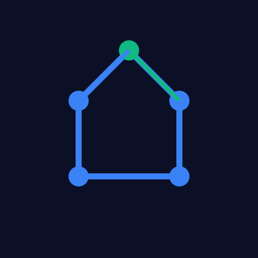

  

<h1 align="center">OmniGraph AI</h1>

  A space-age math visualizer powered by Nvidia NIM and Vercel Serverless Functions.

  
  
  

---

### 🚀 Core Philosophy

OmniGraph AI rejects traditional, tedious frame-by-frame animation interfaces. Instead, it leverages generative AI to instantly plot mathematical concepts onto a dynamic whiteboard. Built on the **Cosmic Blueprint** design system, the UI is unobtrusive, sharp, and highly responsive, utilizing deep celestial blues and geometric precision to create a tactical, space-age environment.

### ✨ Key Features

- **Whiteboard-First Engine:** When asked to explain a concept (parabola, hyperbola, circle), the AI immediately streams a valid SVG diagram to the blue whiteboard before providing a brief 1-2 sentence explanation.
- **SSE Streaming:** Server-Sent Events ensure the AI's text and SVG code render word-by-word, eliminating blank screen wait times.
- **Floating Audio Island:** A sleek, floating widget provides Play/Pause and Stop controls for the AI's voice output, seamlessly integrated without cluttering the UI.
- **Dynamic 5-Dot Resonance Loader:** A custom loading animation where 5 dots form a horizontal line, perform a wave, step into a pentagon formation like coordinated soldiers, and spin.
- **Turbulent Vignette Voice Mode:** When using the mic, the keyboard vanishes, replaced by a lightweight, curved liquid vignette that reacts to real-time microphone volume.
- **PWA Optimized:** Installable to the home screen, working offline with a smart service worker that updates instantly without cache-clearing.
- **Lifecycle Management:** Uses the Page Visibility API to instantly halt AI voice processing and requests when the user switches apps, saving battery and API costs.

### 🛠️ Tech Stack

- **Frontend:** Vanilla HTML/CSS/JS (No framework bloat). Uses Web Audio API, Web Speech API, and CSS `clip-path` for UI geometry.
- **Backend:** Vercel Serverless Functions (Node.js). Handles rate-limiting, duplicate request blocking, and SSE streaming.
- **AI Model:** Nvidia NIM (`meta/llama-3.1-70b-instruct`) via the Nvidia Integrate API.

### 📄 License

This project is open-source and available under the MIT License.
